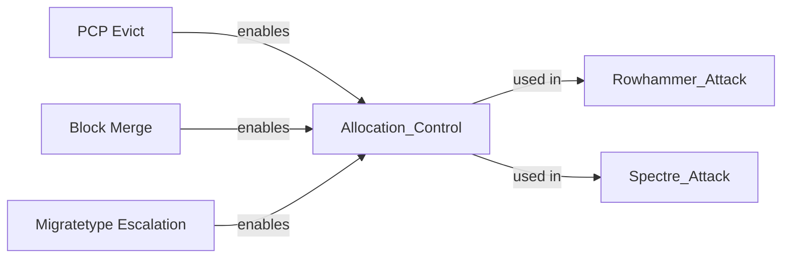
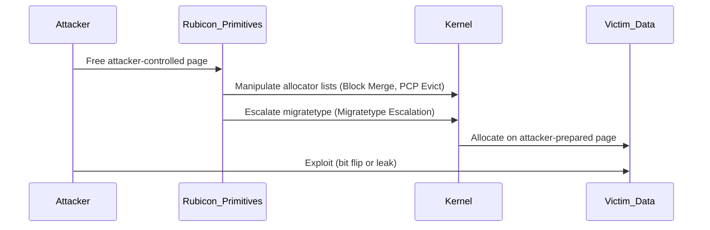

# **Rubicon: Precise Microarchitectural Attacks with Page-Granular Massaging**

Matej Bölcskei, Patrick Jattke, Johannes Wikner, Kaveh Razavi (ETH Zurich)  

---

## **Glossary of Terms, Abbreviations, and Techniques**

| Term / Abbreviation                   | Meaning                                                                                                                                                      |
|--------------------------------------|--------------------------------------------------------------------------------------------------------------------------------------------------------------|
| **Rubicon**                          | The deterministic page-level physical memory massaging technique introduced by this paper, allowing attackers to control which physical pages are used.        |
| **ZBA (Zoned Buddy Allocator)**      | The Linux kernel’s main physical memory allocator, dividing memory into zones and migratetypes, managing allocations using the buddy system.                  |
| **Buddy System**                     | A memory allocation strategy that splits and merges memory blocks in powers of two to reduce fragmentation and improve efficiency.                             |
| **PCP (Per-CPU Pages)**              | Per-CPU caches of free memory blocks maintained by the ZBA to avoid global lock contention and speed up allocations.                                           |
| **Migratetype**                      | Memory block classification based on mobility (e.g., MOVABLE, UNMOVABLE, RECLAIMABLE), guiding the allocator on placement and reuse.                         |
| **NUMA (Non-Uniform Memory Access)** | A hardware architecture where different CPU cores access different parts of memory with varying latency.                                                      |
| **TRR (Target Row Refresh)**         | A DRAM mechanism refreshing nearby rows when one is hammered repeatedly to mitigate Rowhammer attacks.                                                        |
| **PTE (Page Table Entry)**           | An entry mapping a virtual address to a physical memory page.                                                                                                |
| **PCP Evict**                        | Rubicon’s mechanism to forcibly empty per-CPU caches by overfilling them, ensuring subsequent allocations come from the attacker-controlled global pool.       |
| **Block Merge**                      | Rubicon’s mechanism to merge attacker-controlled freed blocks into larger blocks, placing them deterministically at the head of the free list.                 |
| **Migratetype Escalation**           | Rubicon’s mechanism to migrate blocks across different migratetypes by exploiting the ZBA’s page-block stealing conditions.                                   |
| **Rowhammer**                        | A hardware attack that induces bit flips in DRAM by repeatedly accessing (hammering) neighboring rows.                                                       |
| **Spectre**                          | A speculative execution attack leaking secrets through side-channel effects left by transiently executed instructions.                                         |
| **RETBLEED**                         | A Spectre variant bypassing retpoline mitigations by abusing return instruction predictions.                                                                  |
| **Meltdown**                         | A speculative execution attack leaking privileged kernel memory into user space.                                                                             |
| **Blacksmith**                       | A Rowhammer fuzzer that finds effective DRAM hammering patterns to bypass mitigations like TRR.                                                              |
| **Page Spraying**                    | Filling memory with many copies of the same structure, hoping one lands at a target physical location.                                                       |
| **Page Cache**                       | The kernel’s memory cache holding file-backed pages to speed up file operations.                                                                             |
| **procfs**                           | A virtual filesystem (e.g., /proc/zoneinfo, /proc/buddyinfo) exposing kernel internals, sometimes used by attackers for memory manipulation.                 |
| **ASLR (Address Space Layout Randomization)** | A defense technique randomizing memory layout to make exploitation harder.                                                                                   |
| **THP (Transparent Huge Pages)**     | A Linux feature providing large (2 MiB) memory pages for performance; sometimes used in attacks for easier contiguous allocation.                           |
| **Side Channel**                     | An indirect method for leaking sensitive data by observing system-level behavior like timing or cache access patterns.                                       |
| **Contiguous Memory**                | A physically continuous block of memory pages, useful for attacks or hardware interactions.                                                                  |
| **Page Block**                       | A ~2 MiB unit inside the ZBA that groups smaller blocks and governs migratetype transitions.                                                                |
| **ION Allocator**                    | Android’s DMA memory allocator, historically used in mobile Rowhammer attacks.                                                                              |
| **KSM (Kernel Samepage Merging)**    | A Linux optimization that merges identical memory pages across processes, but can be exploited in attacks.                                                   |

---

## **Problem**

Microarchitectural attacks like **Rowhammer** and **Spectre** need to target precise physical memory locations.

However, the **Linux kernel allocator (ZBA)**:
- is complex, splitting memory into zones, migratetypes, and per-CPU caches;
- offers no attacker-accessible way to deterministically control where victim data lands;
- leaves attackers relying on:
  - **Spraying** (filling memory with many targets, hoping one aligns) → inefficient and unreliable;
  - **Scanning** (searching memory using slow side channels) → slow and noisy;
  - **Special allocators** (like ION or DMA) → often disabled or unavailable.

Without reliable, universal **page-level control**, attackers face high overhead, low success rates, or incomplete coverage.

---

## **What This Paper Introduces**

Rubicon introduces a **general, deterministic technique** for page-granular physical memory massaging on Linux:
- Allows attackers to **place victim data on a specific physical page** under their control.
- Works **without relying on exotic or privileged system features**.
- Enables:
  - **Deterministic Rowhammer attacks** on x86.
  - **Massive speedups** for Spectre/RETBLEED attacks (up to 284× faster).

Rubicon is built from **three novel primitives**:
1. **PCP Evict**: Evicts per-CPU page caches to pull allocations from global lists.
2. **Block Merge**: Merges attacker-controlled freed blocks to create high-priority large blocks.
3. **Migratetype Escalation**: Crosses migratetypes by exploiting the allocator’s block-stealing heuristics.

---

## **Algorithmic Flow**

Here’s a **high-level flow** of Rubicon’s attack preparation:

```mermaid
graph TD
    A[Start: Identify attacker-controlled page] --> B[Step 1: Free page back to pool (Block Merge)]
    B --> C[Step 2: Move page across migratetypes (Migratetype Escalation)]
    C --> D[Step 3: Evict per-CPU caches (PCP Evict)]
    D --> E[Step 4: Trigger victim allocation (e.g., page table, /etc/shadow)]
    E --> F[Step 5: Exploit (bit flip or leak secret)]
```

---

### **Detailed Breakdown**

| Step                          | Description                                                                                                                                                         |
|-------------------------------|---------------------------------------------------------------------------------------------------------------------------------------------------------------------|
| 1. **Identify target**        | Use Rowhammer templating (for flippable bits) or Spectre physical address leaks to select a target page.                                                            |
| 2. **Page to pool**           | Use Block Merge: free attacker-controlled pages and force them to merge into a large block at the head of the desired free list.                                    |
| 3. **Pool to pool**           | Use Migratetype Escalation: trigger the ZBA to steal the attacker’s page into the desired migratetype (e.g., page tables, page cache).                             |
| 4. **Page from pool**         | Use PCP Evict: overfill per-CPU caches so the next allocation pulls directly from the attacker-controlled block.                                                   |
| 5. **Trigger allocation**     | Use system calls or program behavior to cause the kernel to allocate the victim data on the prepared page.                                                         |
| 6. **Exploit**               | Rowhammer: flip critical bits for privilege escalation; Spectre: leak data directly without scanning huge memory spaces.                                             |

---

### **Rubicon Primitive Relationships**



---

## **Key Results**

| Attack Type            | Baseline Approach                                | Rubicon Result                                           |
|------------------------|-------------------------------------------------|---------------------------------------------------------|
| **Rowhammer (x86)**    | No deterministic privilege escalation without DMA, huge pages, or deduplication. | First fully deterministic exploit, with 100% success rate. |
| **Spectre (RETBLEED)** | Leak /etc/shadow in ~45 min (Intel), ~3–5 min (AMD). | Leak /etc/shadow in ~9.5 sec (Intel), ~27.9 sec (AMD); 6.8×–284× speedup. |

---

## **Mitigations Proposed**

- Add **individual counters per PCP list** → stop full PCP Evict across list sets.
- Remove **page block stealing heuristic** → prevent cross-migratetype escalation.
- Introduce **batch size randomization** → block deterministic placement via Block Merge.

These mitigations were evaluated to:
- **stop Rubicon (0% success)** in microbenchmarks;
- **impose <0.1% performance overhead** in system tests.

---

## **Future Work Directions**

### 1. **Portability Beyond Linux**
- Can Rubicon’s primitives or ideas be adapted to:
  - Windows kernel memory allocators?
  - FreeBSD or macOS allocator architectures?
  - Hypervisors managing guest memory in cloud VMs?

### 2. **Hypervisor and Cloud Scenarios**
- Investigate whether Rubicon-like primitives can pierce hypervisor protections or manipulate memory in multi-tenant environments.

### 3. **Generalization to Other Attack Classes**
- Explore whether deterministic allocator massaging can benefit:
  - Cache side-channel attacks (e.g., Prime+Probe).
  - Software-level attacks (e.g., heap layout manipulation).
  - GPU or accelerator memory attacks.

### 4. **Resilience of Mitigations**
- Test whether adaptive or machine-learning-driven attackers can defeat the proposed mitigations.
- Analyze the entropy requirements of batch size randomization to ensure long-term security.

### 5. **Allocator Redesigns**
- Research alternative allocator architectures that:
  - Provide predictable performance and fragmentation control;
  - While inherently preventing cross-privilege or cross-process memory manipulation.

---

## **Concluding Diagram: End-to-End Attack Overview**



---

## **Final Thoughts**

Rubicon marks a **significant advance** in microarchitectural exploitation, providing:
- A **general, deterministic** memory control framework,
- A **foundation for building new attack variants**,
- And a **valuable research case** for allocator hardening and secure memory management design.

