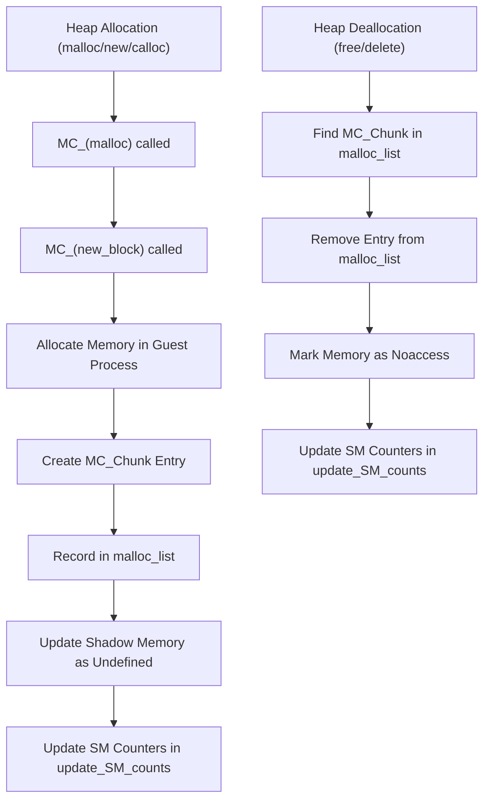
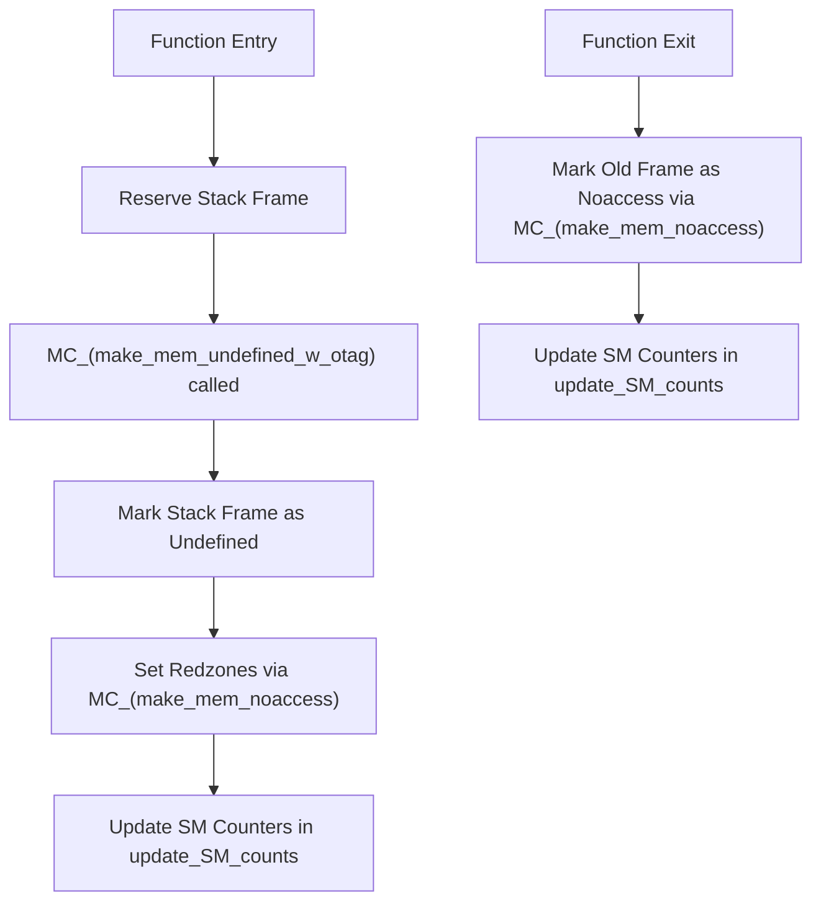

## Heap Tracking: Allocation and Deallocation**

## Stack Tracking: Allocation and Deallocation**

---

## Key Processes:

* **Heap:**

  * Allocation via `MC_(new_block)`:

    * Creates `MC_Chunk` entry, records size, updates shadow memory as **undefined**.
  * Deallocation via `MC_(handle_free)`:

    * Removes `MC_Chunk`, marks memory as **noaccess**, updates shadow memory and counters.

* **Stack:**

  * Function Entry:

    * Marks frame as **undefined** via `MC_(make_mem_undefined_w_otag)`.
    * Sets **redzones** as `noaccess`.
  * Function Exit:

    * Marks frame as **noaccess**.

---

## Key Functions:

* **`MC_(malloc)` / `MC_(new_block)`**: Intercepts heap allocation functions, records memory size, and updates shadow memory as undefined.
* **`MC_(handle_free)`**: Processes heap deallocation, removes entries from the allocation list, and marks the memory as noaccess.
* **`MC_(make_mem_undefined_w_otag)`**: Marks newly allocated stack or heap regions as undefined, with an origin tag for error tracking.
* **`MC_(make_mem_noaccess)`**: Marks regions as noaccess, typically used for freed heap memory, redzones, or returned stack frames.
* **`update_SM_counts()`**: Updates internal memory usage counters based on the state of secondary maps (defined, undefined, noaccess).

## Key Data Structures and Variables

### MC_Chunk

- **Definition:** `MC_Chunk` is a data structure in Memcheck that represents a single heap allocation block.
- **Purpose:** It is used to track the size, start address, and origin context of each heap allocation. This information is essential for identifying memory leaks, use-after-free errors, and tracking active heap blocks.
- **Usage:** 
  - When a heap allocation (`malloc`, `calloc`, `new`) occurs, a new `MC_Chunk` entry is created and added to the `malloc_list`.
  - When the memory is freed (`free`, `delete`), the corresponding `MC_Chunk` is located and removed, and the memory region is marked as `noaccess` in the shadow memory.

---

### Variables Updated in `update_SM_counts()`

| Variable       | Purpose                                              |
|----------------|------------------------------------------------------|
| `n_noaccess_SMs` | Counts 64KB blocks marked as `noaccess`.           |
| `n_undefined_SMs` | Counts 64KB blocks marked as `undefined`.         |
| `n_defined_SMs`   | Counts 64KB blocks marked as `defined`.           |
| `n_non_DSM_SMs`   | Counts blocks that are not uniform (custom shadow maps). |
| `n_issued_SMs`    | Tracks the number of issued custom secondary maps. |
| `n_deissued_SMs`  | Tracks the number of deissued custom secondary maps. |

## Recap: Secondary Map (SM)

- A `Secondary Map` (SM) in Memcheck is a data structure that tracks the validity and addressability state of memory for a 64KB region.
- It stores the shadow memory information for each 4-byte chunk, indicating whether the memory is `defined`, `undefined`, or `noaccess`.
- **Types:**
  - **DSM_DEFINED:** All bytes in the block are valid and initialized.
  - **DSM_UNDEFINED:** All bytes are valid but uninitialized.
  - **DSM_NOACCESS:** All bytes are inaccessible.
  - **Non-DSM:** A custom map for mixed or dynamically changing states.

## Note: 
* Memcheck does not track the stack size explicitly, nor does it maintain a running count of the allocated stack space. Instead, it marks regions of memory as undefined, defined, or noaccess in shadow memory during function entry and exit. Thus, to determine stack size, you would need to analyze the shadow memory to identify all regions currently marked as stack-origin (using origin tags) and count the regions that are not marked as noaccess. This approach is indirect and does not involve the Stack Pointer directly.

